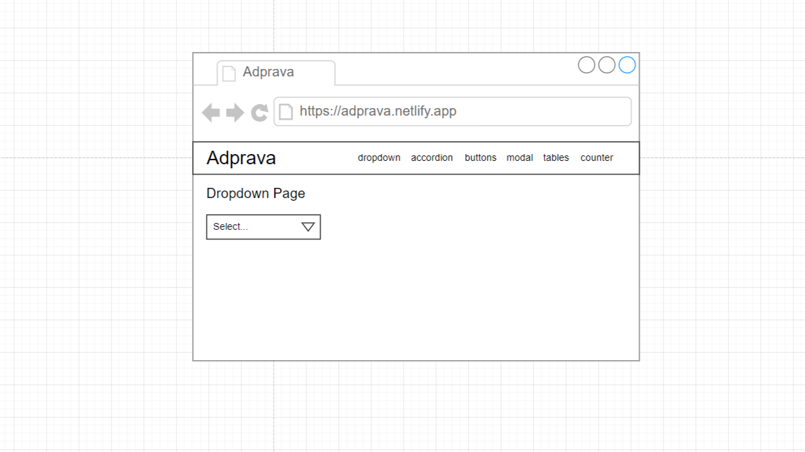
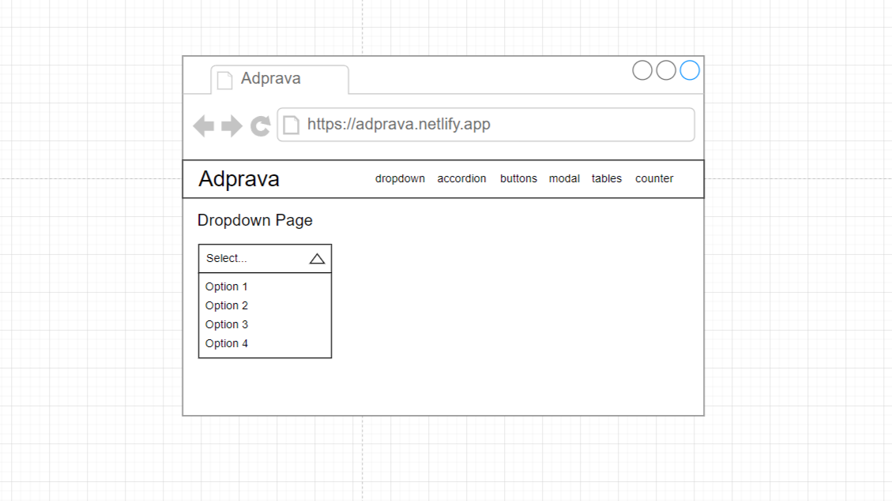
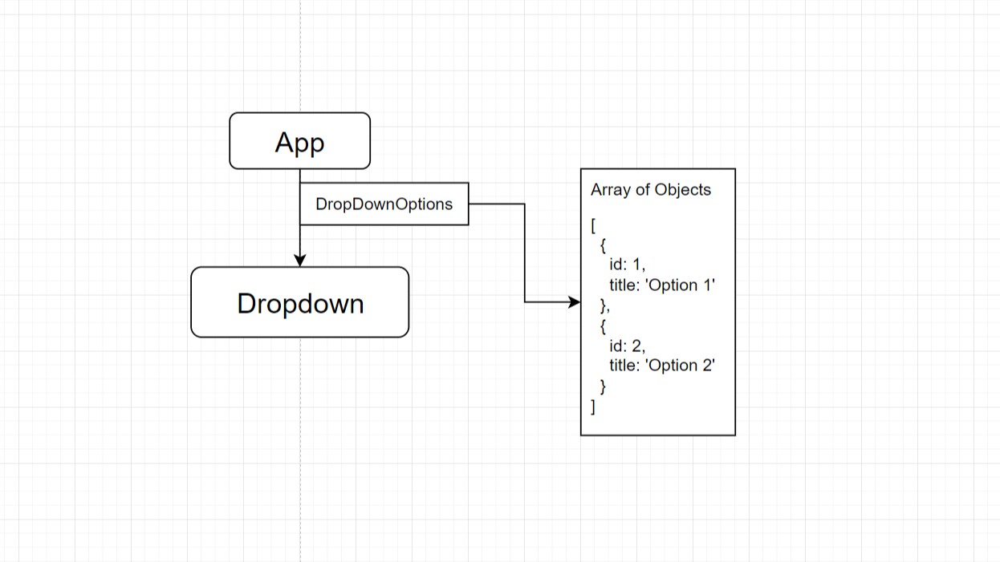
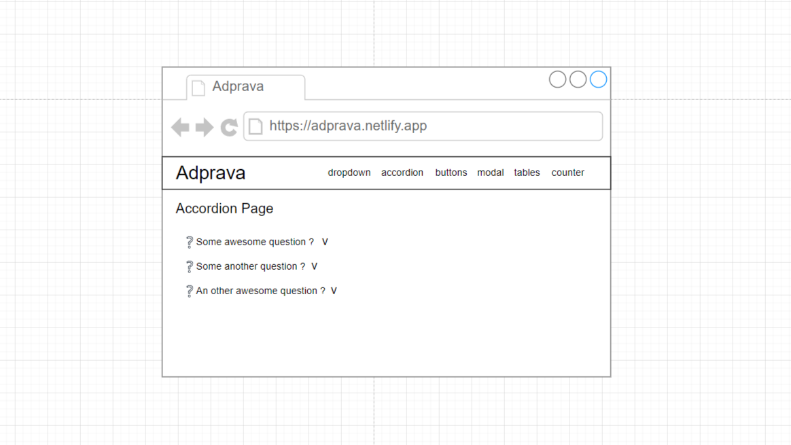
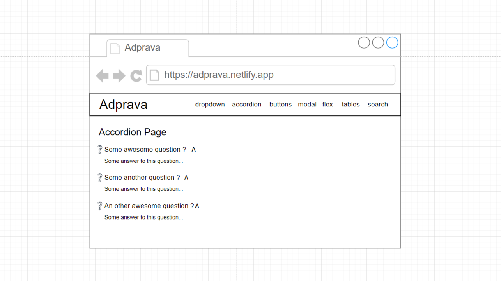
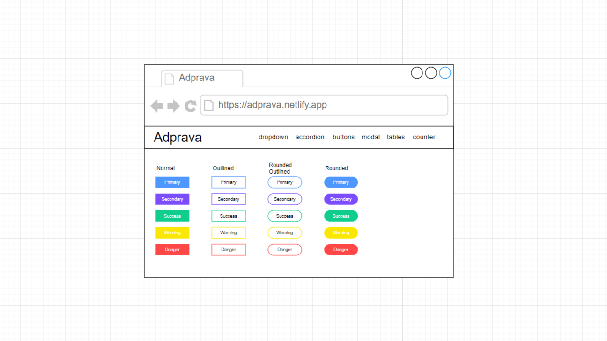

<!--    -->
<div align="center"></div>

<h1 align="center" >A&nbsp d&nbsp p&nbsp r&nbsp a&nbsp v&nbsp a</h1>

<h3 align="center" > A beginner's ReactJS project containing 6 pages and navigation. </h3>


## Introduction
**Adprava** is a practice project that deals with some concepts of ReactJS and NodeJS. This project is built solely with the purpose of learning Web Development, and is being shared with other developers in github for reviews, practice, help to begginers etc reasons.

### Naming
The name is made with mixing two sanskrit words, "Adya" and "Prava" respectively. "Adya" means "Begginer/Beggining Phase" and "Prava" means "Skill". Hence, ***Adprava***.

### Pages
This App would have 7 pages. All the pages requires very different concepts and has their own set of problems to be solved. Those pages are --
1. Dropdown
1. Accordion
1. Buttons
1. Modal
1. Flex
1. Tables 
1. Search

### Concepts covered 
This App covers many basic and intermediet level concepts of ReactJS, some of the termed concepts are given below --
1. State system
1. Hook system    
    * useState()
    * useEffect()
    * useRef()
  
1. Props system
1. Code structuring
1. Tailwind CSS Styling library

---
# About the Project
## The Landing Page (Dropdown Page)
### Diagram
#### CLose

#### Open 


The Dropdown page is simply a Dropdown element rendered in screen. When ever use clicks on it, this dropdown opens and lets the user select from one of the options. The only catch here is that this dropdown element is not rendered using any markup Dropdown elements, rather all the logics are written in javascript and rendered using JSX of ReactJS.

### Data Loading


The App invokes a page named `DropdownPage` in it's `return()` function. The `DropdownPage` contains one heading and the `Dropdown` component. The `Dropdown` component is provided with one prop named `DropDownOptions`, and the data for that prop is imported from `./src/data/qnadata.js`. The the `Dropdown` component maps over the data and returns some jsx.


## Accordion Page
### Diagram
#### Close

#### Open


### About
The `AccordionPage` is a basic list of questions, and if clicked, some extended text appears below the clicked question. Only one of these ***Accordions*** can be extented at a time.

### Data Loading
Data loading of `AccordionPage` and `Accordion` component is exactly the same with the `DropdownPage` and `Dropdown` component. The same data is used in a the logics of `Dropdown` component.


## Buttons Page
### Diagram

### About
The `ButtonsPage` is essentially a showcase of the button theory in React JS. Here we have a component created as `Button` and that can be used as a normal button. The plus point of this `Button` component is that just by passing some simple prop names we can use button configurations from our 20 presets.

### Data Loading
The `App` calls the `ButtonsPage` and the `ButtonsPage` calls the `Button` component with either of `primary`, `secondary`, `success`, `warning`, `danger` prop passed to define button's color. Then the `Button` component can be passed with two optional props `outlined` and `rounded`, and those applies exactly the same style that their name suggests. After that if any other prop, default to a `button` element is passed, those are passed to the actuall `button` element in the `Button` component for data related operations.


---


# User Instructions
## Installation Guide
### Windows

#### Prerequisits
1. nodejs
1. npm
1. create-react-app
1. git
1. terminal
1. chocolaty
1. any text editor

#### **Once you have all the preerequisits installed, you can move forward to clone the repository.**

1. Open powershell

1. Go to your desired directory where you want to clone this repository

1. Type the following in your powershell
    
    ```bash

    git clone git@github.com:yunusparvezkhan/adprava.git

    ```
 
 1. Now if cloning is successful, you have one directory named `adprava` in the directory you cloned the repository. To open this local repository type,
    ```bash

    cd adprava

    ```
    And hit enter.

1. Now you need to install all the dependencies of this project. To do so, type the following command and hit enter,
    ```bash

    npm install

    ```

1. Now to start the app in your browser type,
    ```bash

    npm run start

    ```
    And hit enter.

1. Now if you don't see a browser tab opening automatic, open up a browser and type 
    ```url
    localhost:3000
    ```
    in the url bar and hit enter. 

    >**Note**
    >
    > In this last step the url sometimes might not be `localhost:3000`, it can be `localhost:3001` or `localhost:3002` and so on, depending upon if any other server is running on your machine on the `3000` port. So to avoid any problems, try to see what your terminal is telling you after running the command `npm run start`.


--- 

# Developer's Instructions
### Commit conventions
This project uses the `Delta Commits Convention`. This convention is under development, and this repository is one of the pioneer projects to use this convention. A detailed documentation about this convention would be live on [YPK Org](https://github.com/ypkorg/Delta-Commits-Convention).

### How to report issue

* Whenever reporting an issue related to a commit, always make sure to mention the rsa and also the the delta versioning of that commit.

* Keep your descriptions clear and to the point.
* Mention coding terminologies inside \`  \` backticks.

### How to Contribute
If you have fixed any problem in this project or created some new features to make this project more beutiful, make sure to create a issue, describing the need for your changes, then wait for the author(s) to make a new branch for your changes, then create pull request to that branch. Pull requests to `master` branch will be mostly ignored.