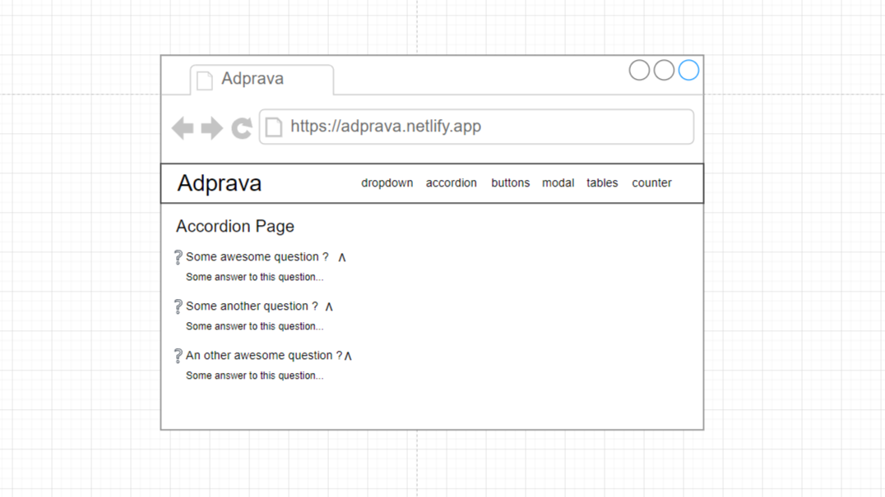

<!--    -->

<h1 align="center" >A&nbsp d&nbsp p&nbsp r&nbsp a&nbsp v&nbsp a</h1>

<h3 align="center" > A beginner's ReactJS project containing 6 pages and navigation. </h3>

## Introduction
**Adprava** is a practice project that deals with some concepts of ReactJS and NodeJS. This project is built solely with the purpose of learning Web Development, and is being shared with other developers in github for reviews, practice, help to begginers etc reasons.

### Naming
The name is made with mixing two sanskrit words, "Adya" and "Prava" respectively. "Adya" means "Begginer/Beggining Phase" and "Prava" means "Skill". Hence, ***Adprava***.

### Pages
This App would have 7 pages. All the pages requires very different concepts and has their own set of problems to be solved. Those pages are --
1. Dropdown
1. Accordion
1. Buttons
1. Modal
1. Flex
1. Tables 
1. Search

### Concepts covered 
This App covers many basic and intermediet level concepts of ReactJS, some of the termed concepts are given below --
1. State system
1. Hook system    
    * useState()
    * useEffect()
    * useRef()
  
1. Props system
1. Code structuring
1. Tailwind CSS Styling library

---
# About the Project
## The Landing Page (Dropdown Page)
### Diagram
#### CLose

#### Open 

The Dropdown page is simply a Dropdown element rendered in screen. When ever use clicks on it, this dropdown opens and lets the user select from one of the options. The only catch here is that this dropdown element is not rendered using any markup Dropdown elements, rather all the logics are written in javascript and rendered using JSX of ReactJS.

### Data Loading

The App invokes a page named `DropdownPage` in it's `return()` function. The `DropdownPage` contains one heading and the `Dropdown` component. The `Dropdown` component is provided with one prop named `DropDownOptions`, and the data for that prop is imported from `./src/data/qnadata.js`. The the `Dropdown` component maps over the data and returns some jsx.

## Accordion Page
### Diagram
#### Close

#### Open

### About
The `AccordionPage` is a basic list of questions, and if clicked, some extended text appears below the clicked question. Only one of these ***Accordions*** can be extented at a time.

### Data Loading
Data loading of `AccordionPage` and `Accordion` component is exactly the same with the `DropdownPage` and `Dropdown` component. The same data is used in a the logics of `Dropdown` component.

