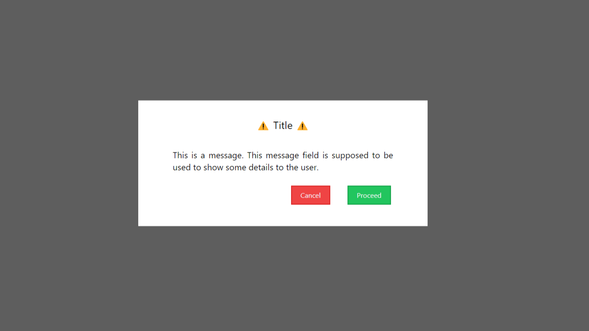

# Angur 🍇 (Version 2)
The version 2 of the `Adprava` app has a new page `ModalPage`. `ModalPage` is a demostration of a component `Modal`. `Modal` is basically a popup box component. The `Modal` popup box has a bold centered title, a text for giving some message to the user and two buttons, one for conformaiton, called `Proceed` and another for cancelation, called `Cancel`. As we go along this Note, we will explore more technical details about it.

## The component `Modal`
`Modal` is basically a popup box component that can be invoked from any other component and can be used for asking for any conformation from the user. This component sends back boolean message to it's parent component according to whether the user accepted the proposal or not.

### Props
The `Modal` component accepts 4 props,    
* heading
* message
* closeModal
* modalConformation

#### heading
The prop `heading` accepts a `string` that is supposed to be a short title of the Modal PopUp box.

#### message
The prop `message` also accepts a `string` that is rendered below the title in a normal font style and size like a paragraph. This prop is supposed to be used for passing the main textual content of the modal.

#### closeModal
The prop `closeModal` accepts a function, that should close the appearence of the `Modal` component in the parent component. This function should be passed to the `Modal` component with this prop. Whenever user clicks on any of the buttons or outside the modal in the background this function is invoked.

#### modalConformation
The `modalConformation` prop sends back a boolean parameter. The `modalConformation` prop should be given a handler function, that would have a conditonal. If the user clicks on the `Proceed` Button, the `modalConformation(true)` function is invoked. And if the user clicks on the `Cancel` Button, the `modalConformation(false)` function is invoked. The parent component can take these boolean values and do some processing with a handler function.

## The Page `ModalPage`
The `ModalPage` is just a demonstration of the `Modal` component. This page has a heading like all the other pages. This page has a `Button` component that invokes a function, which makes a boolean state `modalsts` `true` in the page. When this state is changed, a useEffect function invokes, which sets the `Modal` component's styles to be visible. This page also contains a handler function for the `closeModal` prop accepted by `Modal` component as `handleCloseModal()`. This function basically just makes the `modalsts` state `false`. Then this page also has the handler function for `modalConformation` prop accepted by `Modal` component as `handleModalConformation(status)`. This function just just updates a state `modalConf` with the boolean value it gets from `Modal`. After this there is a `useEffect` function that invokes when the `modalConf` state changes and does some job according to the message it gets from the `Modal`.
