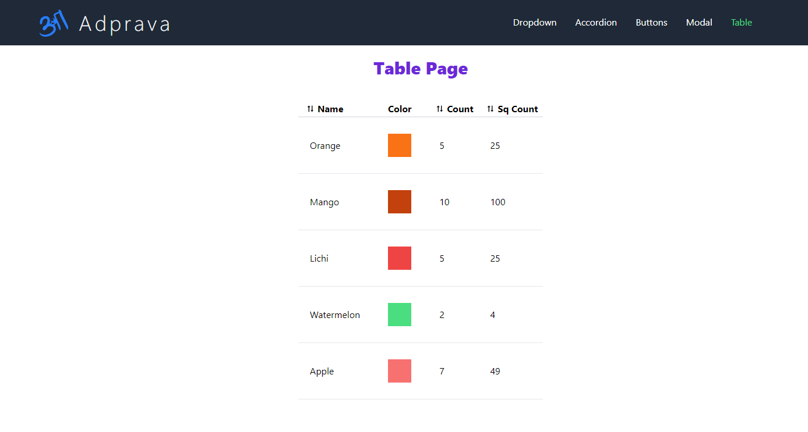
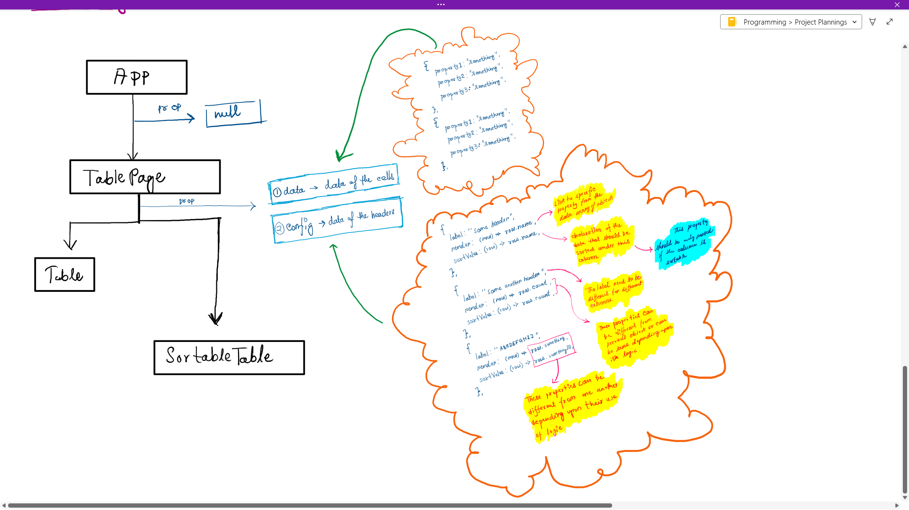
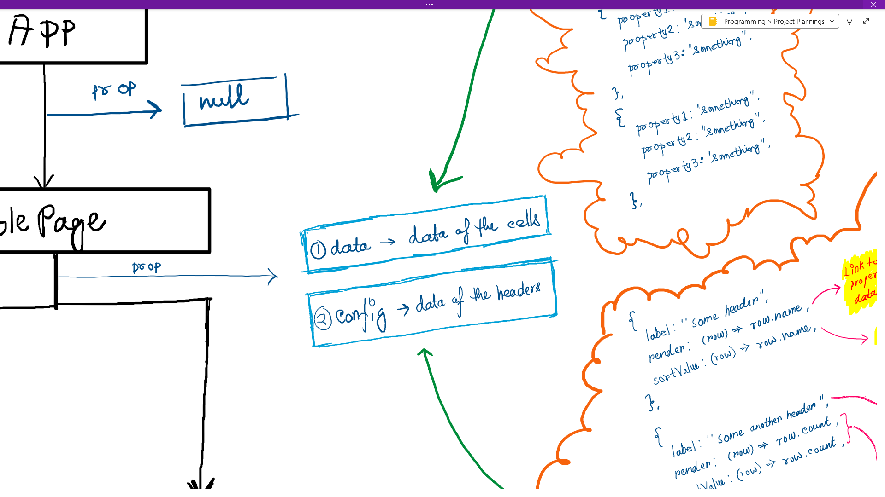
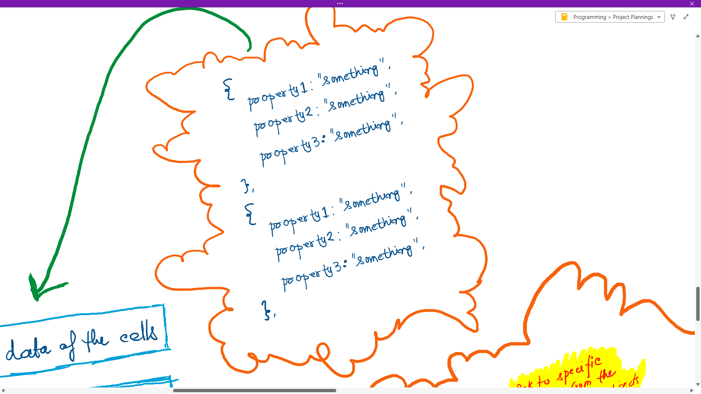
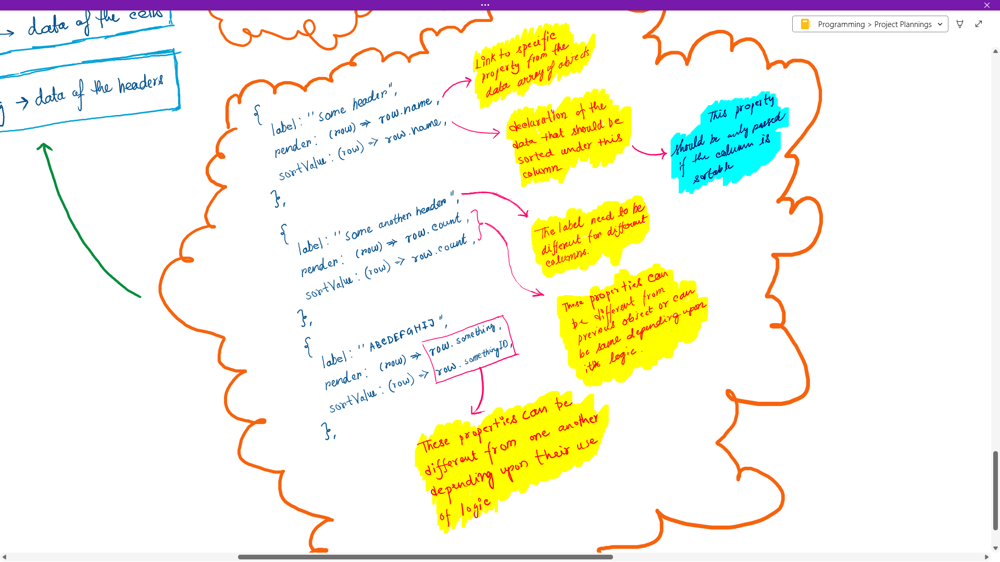

# Tormuj 🍉 (Version 3)
The version 3, `Tormuj` has a wnew page `TablePage`. This page demonstrates two new components `Table` and `SortableTable`. These components are for rendering dynamic Tables by passing data as props. 



## The `Table` component
`Table` is a component to render a decent table. This table is dynamic and controlled by a dataset, in a other file or in a backend server. The `Table` component recieves 3 props as `data`, `config` and `KeyFn`. The `Table` component renders a unsorted table according to the data recieved from these 3 props. Two of them are for data and another for a key generator function.

***Diagram***

***Data Loading***


### The `data` prop
The `data` prop accepts an array of objects. Where each object is a row, and each element inside a object should be values for all the columns on that row.

***Demo***


For example the object for the first row in the first diagram would be,
```js
{
    name:'Orange',
    color:'Orange',
    count:5,
}
```
and the `Sq Count` can be dynamicly calculated in the `config` prop (We will discuss about it later). So, the `data` prop should recieve a array of such objects.

### The `config` prop
The `config` prop also accepts an array of objects. But here each object is a configuration of each column. The properties of these objects are more selective and limited. The properties that the `Table` component recognises in a object inside `config` array are, 

* `label`
* `render`
* `sortValue`
* `header`

***Demo***


#### `label` 
`label` is the header of the column. This property should be a string, and will be rendered inside a `<th>` tag, like -
```html
<th>{config.obj.label}</th>
```

#### `render`
`render` property should be a function. This property tells the `Table` component that which properties from `data`'s objects should be rendered in this column. The function accepts one argument `row`, (that is the entire single object from `data`) and should return the property that should be rendered in this column as `row.property`. Demonstration is given in the diagram above.

```js
{
    header: 'some heading',
    render: (row) => row.name,
    ...
}
```

#### `sortValue`
This property in `config` objects is optional. If the column contains data, that can be logically sorted (i.e numbers, strings) then this property should be pressent in that column's `config` object. This property accepts a function, which recieves objects from `data` and returns that property that should be sorted,when user clicks on the header.

```js
{
    header: 'some heading',
    render: (row) => row.name,
    sortValue: (row) => row.name,
}
```

#### `header`
This property is also super optional. This property can be used in times when developers want to show the heading inside any other tag or in any other style. In other words, this property can be used to control the behaviour of the heading of the column. This property accepts a fucntion, where it recieves nothing, but returns a jsx tag. This tag is expected to contain a heading, because this tag would be rendered in the column's heading's place.

```js
{
    header: 'some heading',
    render: (row) => row.name,
    sortValue: (row) => row.name,
    header: () => <h1 style={{color:'#505050'}}>some heading</h1>
}
```

### The `KeyFn` prop
The `KeyFn` prop accepts a function, which recieves a argument, that is a object from either `data` or `config` and returns a unique value according to that object. This value is used as unique key in mapped elements.

***Example***
```js
const keyFn = (obj) => {
        if (obj.name) {
            return obj.name;
        } else if (obj.label) {
            return obj.label;
        }else {
            return obj[1];
        }
    }
```    


## The `SortableTable` component
`SortableTable` is a component to render a table with sortable optionalities. This table is dynamic and controlled by a dataset, in a other file or in a backend server as like the `Table` component. The `SortableTable` component has exactly the same data loading as the `Table` component, which means it recieves 3 props as `data`, `config` and `KeyFn`. The `SortableTable` component renders a unsorted table at first, but if clicked on the column headers, it renders the rows in acsending order according to the values of that column. The 2 of the props are for data and another for a key generator function. There is no need to put repeated informations here, read about the data-loading and the role of the props above in the `Table` components' details.